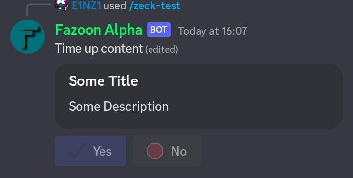

# ConfirmButtons 
Want to create your own confirm Buttons. This is for you

Define The module.
```js
const { EmbedBuilder } = require("discord.js");
const { confirmButtons } = require("zeck.js");
```
```js
await interaction.deferReply();

const embed = new EmbedBuilder()
.setTitle("Some Title")
.setDescription("Some Description")
.setColor("#303136")
// etc

confirmButtons(interaction, {
            embed: embed,
            authorOnly: `Only <@${interaction.member.id}> can use these buttons`,
            yes: {
                style: ButtonStyle.Primary,
                label: "Yes",
                emoji: "✔️",
            },
            no: {
                style: ButtonStyle.Secondary,
                label: "No",
                emoji: "🛑",
            },
        }).then(async (confirm) => {
            if (confirm === "yes") {
                interaction.editReply({
                    content: `Content to show when pressed yes`,
                });
            }
            if (confirm === "no") {
                interaction.editReply({
                    content: `Content to show when pressed no`,
                });
            }
            if (confirm === "time") {
                interaction.editReply({
                    content: `Time up content`,
                });
            }
        });
```

| Options | Description | Required |
| ---------- | ---------------- | ----- |
| embed | embed to show | ✅️ |
| authorOnly | authorOnly message | ❌️ |
| yes | yes button options | ❌️ |
| no | no button options | ❌️ |


## ScreenShots



